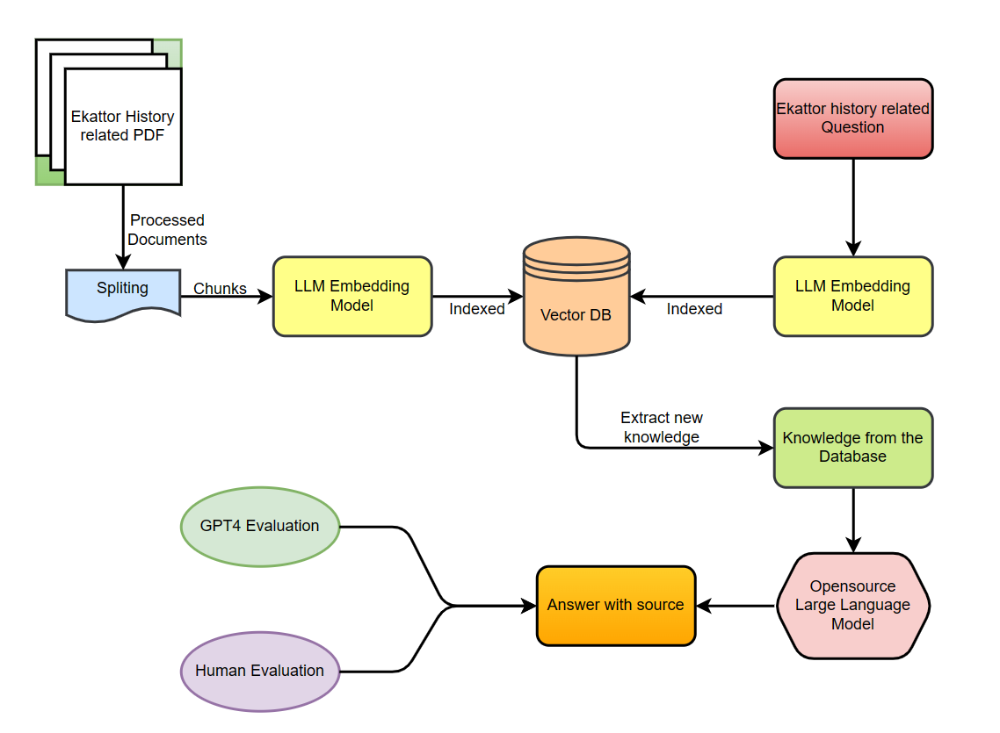

# Researcher

#### Technical Skills: Python, SQL, Pytorch, MATLAB, Qiskit

## Education 			        		
- B.S.CSE  | North South University (June 2023) | 

## Work Experience
**Research Assistant @ Md. Shahriar Hussain, North South University ( May 2024 - Present )**
- Researching detecting hallucinations in LLM models within the context of low-resource third-world countries, and introducing techniques to mitigate these challenges.

**Research Assistant @ Dr. Razib Hayat Khan, North South University ( Aug 2023-Mar 2024 )**
- Researched and identified information gaps and developed a data-driven Android app to provide essential resources for children with ASD, ensuring users have tailored access to crucial support and services.

## Projects
### Towards Accurate AI-Driven Historical QA: A Retrieval-Augmented Model for Bangladeshi History

Recent advancements in large language models (LLMs) have driven impressive progress in question-answering tasks, though challenges such as hallucination and misinformation remain. Our project introduces QA, an Open Source Conversational AI system tailored for Bangladesh's History, designed to mitigate these issues by integrating LLMs with human-verified data sources. This innovative approach not only strengthens accuracy but also sets a foundation for scalable, domain-specific chat models that can maintain reliable information integrity across diverse applications.

### A Secure Image Transmission Scheme Using Chaos and Quantum Entanglement
[arxiv]([https://www.mdpi.com/1424-8220/22/8/3048](https://arxiv.org/abs/2311.18471))

The advent of quantum computing has introduced significant security challenges for conventional cryptographic systems, particularly in the realm of optical communications. This research addresses these challenges by pioneering a secure image transmission scheme that integrates quantum key distribution (QKD) using the E91 protocol with logistic chaotic maps. Leveraging the unpredictability of chaotic systems alongside the secure properties of quantum entanglement, our approach incorporates an eavesdropping detection mechanism based on the CHSH inequality. This feature enhances resilience against unauthorized access, ensuring robust data integrity and security.

Through extensive simulations, we demonstrate this scheme's high entropy, sensitivity, and encryption efficiency, showcasing its potential as a defense against emerging quantum-based threats. The results illustrate the scheme's high effectiveness in encrypting images and highlight its promise in secure data transmission. By blending chaos theory with QKD, our work offers a novel framework for secure data and image handling in optical communications—essential for safeguarding sensitive information in an era of data vulnerability and quantum advancements.

### We-Care
[GitHub](https://github.com/Remian-9080/CSE-299_ASD-HELP)
This Android-based project offers a supportive app for families of children with Autism Spectrum Disorder (ASD), connecting users with essential resources from schools, doctors, and NGOs. By serving as a bridge to close information gaps, the app ensures that families have easy access to relevant guidance, educational resources, and specialized support. Designed to empower users with timely and accurate information, the app fosters a more connected and supportive community for ASD-related care.

